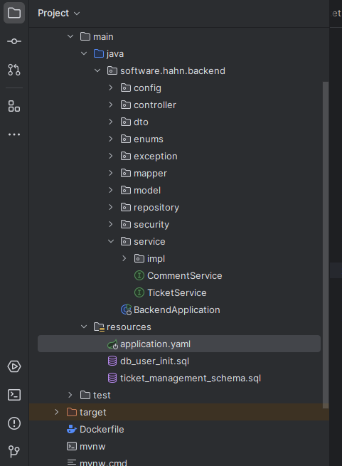

# IT Support Ticket Management System

This project is a simple IT Support Ticket management application. It consists of:

- **Backend**: A Spring Boot application (Java 17) exposing a REST API with Swagger/OpenAPI.  
- **Database**: Oracle DB storing tickets, users, comments, and audit logs.  
- **Frontend**: A Java Swing desktop client that consumes the REST API.

## Features

- **Ticket Creation**: Employees create tickets with Title, Description, Priority (Low, Medium, High), Category (Network, Hardware, Software, Other), and automatic Creation Date.
- **Status Tracking**: Tickets transition between `NEW`, `IN_PROGRESS`, and `RESOLVED` (updated only by IT Support).
- **User Roles**:
  - **EMPLOYEE**: Create and view own tickets.
  - **IT_SUPPORT**: View all tickets, update statuses, and add comments.
- **Audit Log**: Tracks status changes and comments.
- **Search & Filter**: Search tickets by ID and status.

## Technology Stack
- **Backend**: Java 17, Spring Boot 3, RESTful API with Swagger/OpenAPI
- **Database**: Oracle SQL (tested with Oracle XE 21c)
- **Frontend**: Java Swing (MigLayout)
- **Testing**: JUnit, Mockito
- **Deployment**: Docker (backend + Oracle DB), executable JAR (Swing client)

## Prerequisites
- **Java 17**: For building and running locally.
- **Maven 3.8+**: For dependency management and builds.
- **Docker & Docker Compose**: For containerized deployment.
- **Git**: For version control and submission.

## Project Structure



## Installation and Usage

### Method 1: Running Without Docker

You can run everything locally (for development) using Maven and a local Oracle database instance.

1. **Set up the Oracle Database**
    - Ensure you have an Oracle DB running (e.g. Oracle XE).
    - Create a user (e.g. `c##chakir`) with a password (e.g. `chakir2001`).
    - (Optional) Run the included SQL script (`ticket_management_schema.sql`) to set up sample data. For example:

      ```sql
      sqlplus sys/chakir2001@localhost:1521/XE as sysdba
      ALTER SESSION SET CONTAINER=XE;
      -- CREATE USER c##chakir IDENTIFIED BY chakir2001;
      -- GRANT CONNECT, RESOURCE TO c##chakir;
      -- ALTER USER c##chakir DEFAULT TABLESPACE users;
      -- ALTER USER c##chakir QUOTA UNLIMITED ON users;
 
      -- Then:
      sqlplus c##chakir/chakir2001@localhost:1521/xe
      @ticket_management_schema.sql
      ```

2. **Configure Spring Boot**  
   Update `backend/src/main/resources/application.yaml` with your Oracle DB info

3. **Build and Run the Backend**

   ```bash
   cd it-support-ticket-system/backend
   mvn clean package
   java -jar target/backend-0.0.1-SNAPSHOT.jar
   ```

   - The backend should start on [http://localhost:8080](http://localhost:8080).

4. **Build and Run the Swing Client**

   ```bash
   cd it-support-ticket-system/frontend
   mvn clean package
   java -jar target/frontend-1.0-SNAPSHOT-jar-with-dependencies.jar
   ```

5. **Login**
   - Use test users you inserted into the DB. For example:
     - `employee1 / 1234` (Role: EMPLOYEE)
     - `it_support1 / 1234` (Role: IT_SUPPORT)

### Method 2: Running With Docker

1. **Update `docker-compose.yml`** (place this in the project root):
   ```yaml
   version: '3.8'
   services:
     oracle-db:
       image: gvenzl/oracle-xe:21-slim
       container_name: oracle-db
       environment:
         - ORACLE_PASSWORD=chakir2001
         - APP_USER=c##chakir
         - APP_USER_PASSWORD=chakir2001
       ports:
         - "1521:1521"
       volumes:
         - ./backend/src/main/resources/ticket_management_schema.sql:/docker-entrypoint-initdb.d/ticket_management_schema.sql

     backend:
       build:
         context: ./backend
         dockerfile: Dockerfile
       container_name: it-support-backend
       depends_on:
         - oracle-db
       ports:
         - "8080:8080"
       environment:
         - SPRING_DATASOURCE_URL=jdbc:oracle:thin:@oracle-db:1521/XEPDB1
         - SPRING_DATASOURCE_USERNAME=c##chakir
         - SPRING_DATASOURCE_PASSWORD=chakir2001
   ```

2. **Create a `Dockerfile`** (place this in `backend/`):

   ```Dockerfile
   FROM maven:3.8.6-openjdk-17 AS build
   WORKDIR /app
   COPY pom.xml .
   COPY src ./src
   RUN mvn clean package -DskipTests

   FROM openjdk:17-jdk-slim
   WORKDIR /app
   COPY --from=build /app/target/backend-0.0.1-SNAPSHOT.jar app.jar
   EXPOSE 8080
   ENTRYPOINT ["java", "-jar", "app.jar"]
   ```

3. **Deploy with Docker**

   ```bash
   cd it-support-ticket-system
   docker-compose up --build
   ```

4. **Access**
   - **Backend:** [http://localhost:8080](http://localhost:8080)
   - **Oracle DB:** `localhost:1521` (service name: `XEPDB1`)

5. **Troubleshooting**
   - Ensure Docker is running.
   - Check container logs if the backend fails to connect to the DB:
     ```bash
     docker logs it-support-backend
     docker logs oracle-db
     ```
   - The Oracle container may take a minute to initialize fully.

## Swing Client as an Executable JAR

1. **Build the JAR**
   ```bash
   cd frontend
   mvn clean package
   ```
   This generates `target/frontend-0.0.1-SNAPSHOT-jar-with-dependencies.jar`.

2. **Run the JAR**
   ```bash
   java -jar target/frontend-0.0.1-SNAPSHOT-jar-with-dependencies.jar
   ```
   - Ensure the backend is running at [http://localhost:8080](http://localhost:8080).

## GitHub Submission

1. **Initialize Git Repository**
   ```bash
   cd it-support-ticket-system
   git init
   git add .
   git commit -m "Initial commit of IT Support Ticket System"
   ```

2. **Create GitHub Repository**
   - Go to GitHub and create a new repository (e.g., `it-support-ticket-system`).
   - Copy the repository URL.

3. **Push to GitHub**
   ```bash
   git remote add origin <repository-url>
   git branch -M main
   git push -u origin main
   ```

4. **Files to Include**
   - `README.md`
   - `API_DOCS.md`
   - `docker-compose.yml` (in root)
   - `backend/` (all source code, `pom.xml`, and resources)
   - `frontend/` (all source code, `pom.xml`)
   - `.gitignore`:
     ```
     target/
     *.log
     .idea/
     *.iml
     ```

## Testing

Run backend tests:
```bash
cd backend
mvn test
```
